# SchoolMart App

 

#### Description
SchoolMart is a full-featured e-commerce application offering a wide range of school stationery items built using the MERN stack. Originally designed as a school inventory tool, it has been extended with e-commerce functionality, allowing users to browse items, add them to a cart, proceed to checkout, and view their order history.
Admins can manage inventory with full CRUD operations on items and categories, upload images via Google Drive API. Users benefit from a smooth, responsive shopping experience, complete with category-based search and order management.

#### Key Features
- E-commerce functionality: Add to cart, checkout, and order history tracking.
- Admin panel for managing items, categories.
- Category-based search for easier navigation.
- Google Drive API integration for image uploads and storage.
- Responsive UI with real-time updates.
- Secure RESTful API and robust backend with Express and MongoDB.

#### Purpose
This project helped to enhance my hands-on experience in building full-stack web applications with advanced features such as third-party API integration, dynamic state management, and e-commerce workflows. It highlights both my frontend and backend development capabilities.

 

## Technology Stack :

(MERN Stack)

- MongoDB
- Express JS
- React JS
- Node JS
- Google Drive API
- Other - MUI Components

 

## Links :

- [Demo](https://drive.google.com/file/d/1vZ0Vt_JIZGkhNQVcNTAKIoIYZxeUhzLT/view?usp=sharing)

 

## Screenshots :

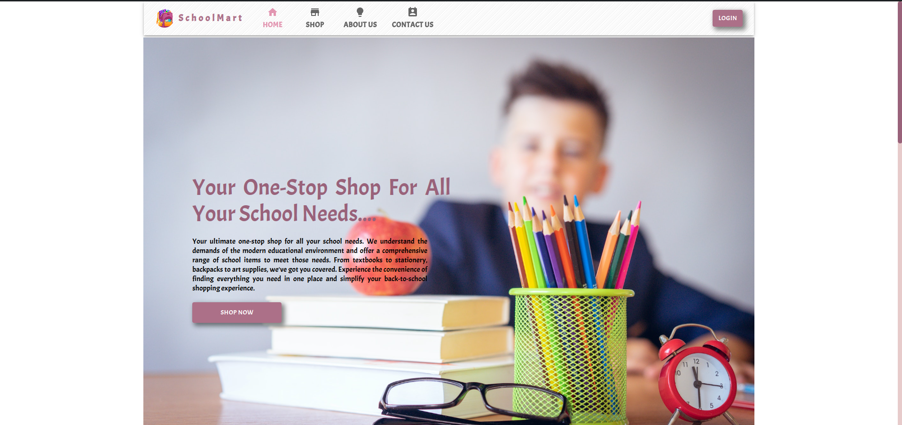
<!-- 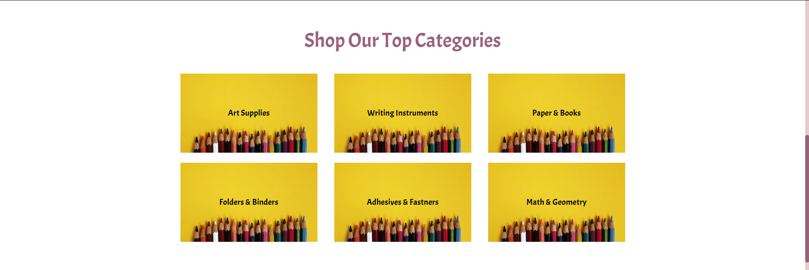 -->
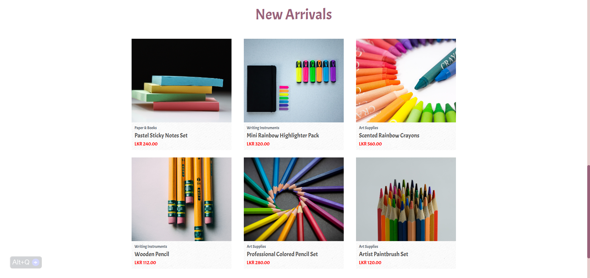
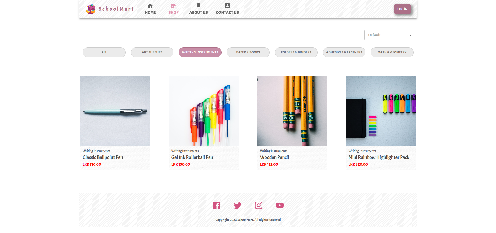
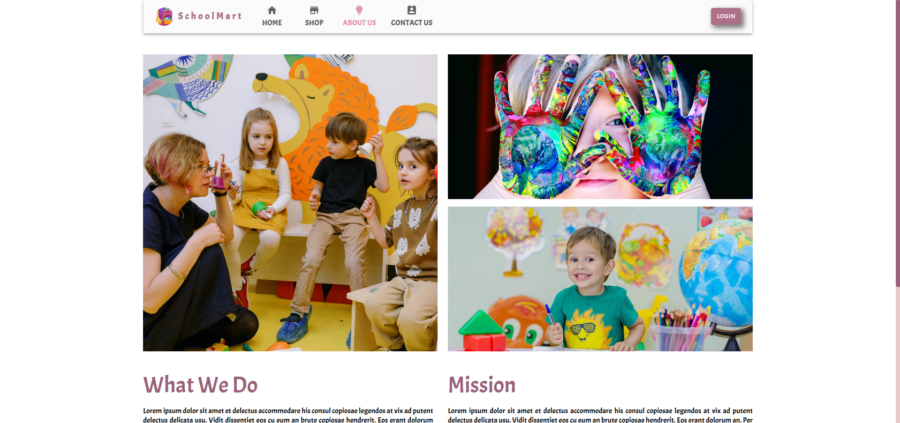
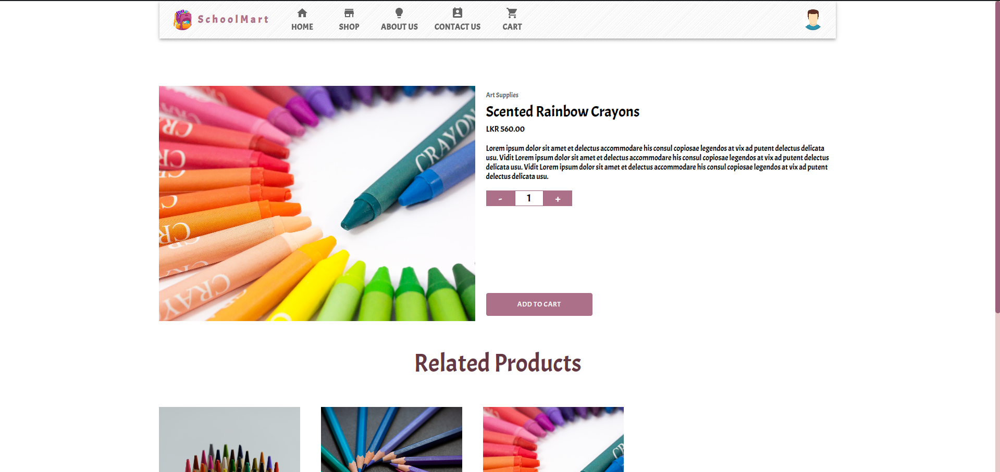
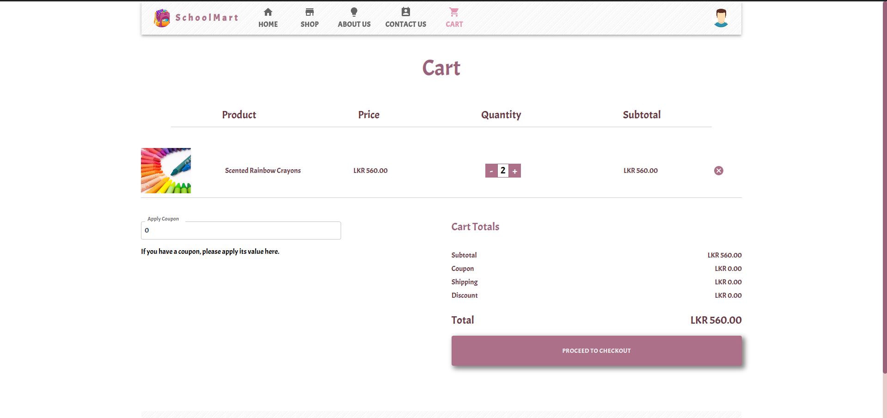
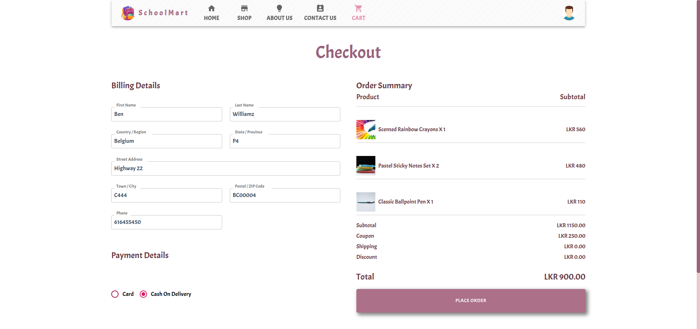
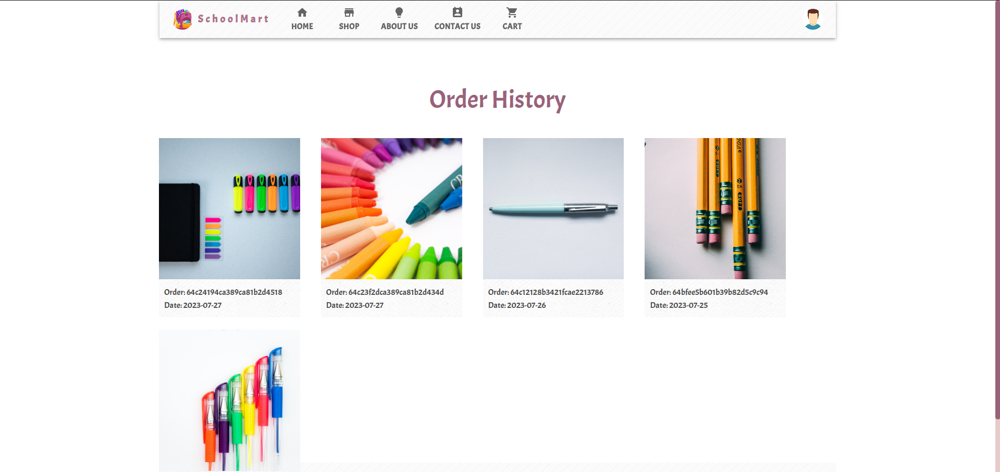
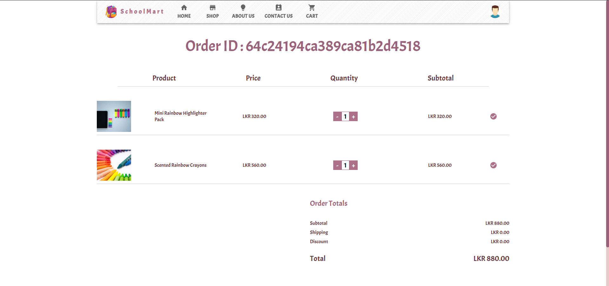
<!-- 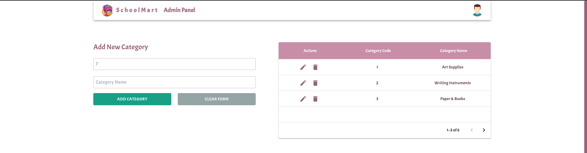 -->
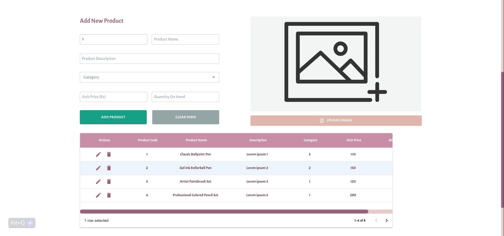
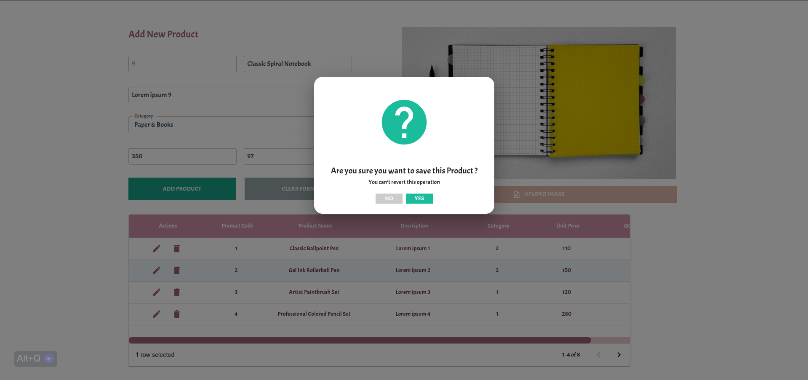
