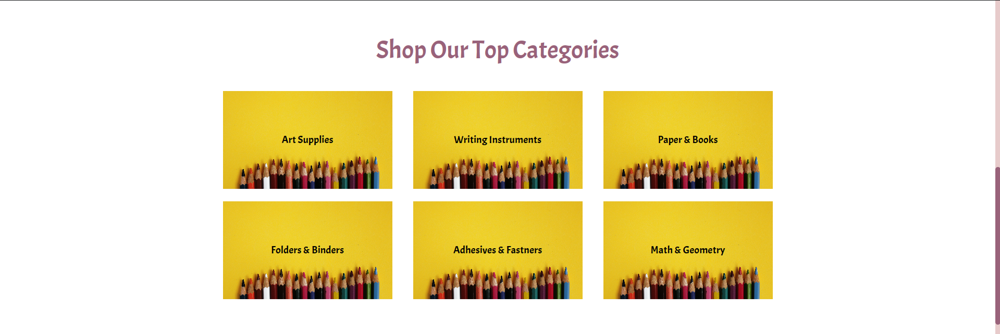
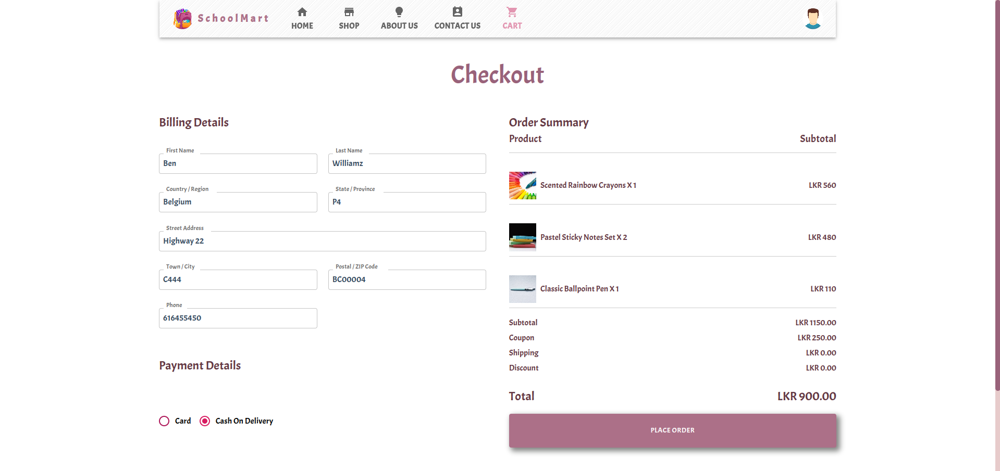
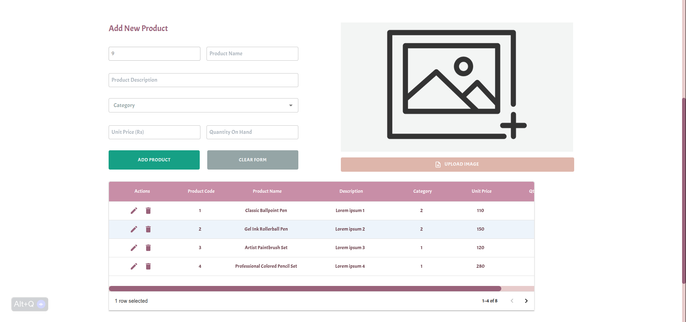
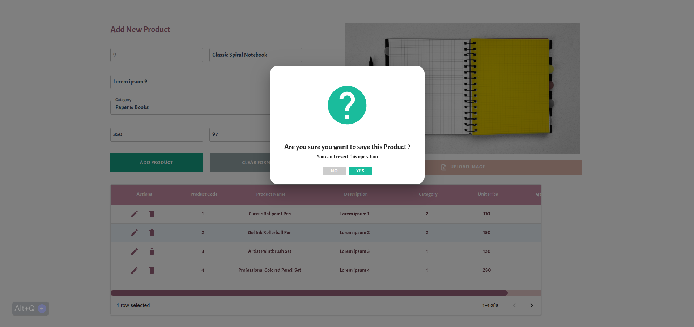

# SchoolMart App

### An e-commerce application offering a wide range of school stationery items.

 

## Technology Stack :

(MERN Stack)

- MongoDB
- Express JS
- React JS
- Node JS
- Other - MUI Components

 

## Links :

- [Demo](https://drive.google.com/file/d/1vZ0Vt_JIZGkhNQVcNTAKIoIYZxeUhzLT/view?usp=sharing)

 

## Screenshots :

<!--  -->

<!--  -->

